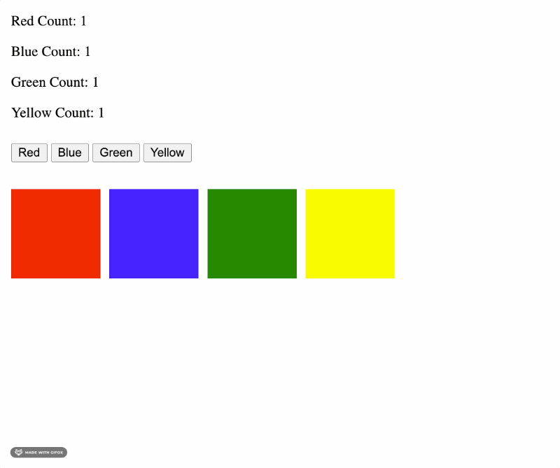

# Color Blocks 🟥 🟦 🟩 🟨 Solo Challenge

We are building an application that creates color blocks on the DOM, based on button clicks. Additionally, we are going to be tracking the number of blocks for each color. When a user clicks on a color button, it will create a color block and update the corresponding color count.

## Assignment Objectives

- Practice Read and Write skills
- Solidify jQuery knowledge
  - Selectors
  - Dynamic Content
  - Methods `.on()`, `.append()`, `empty()`

---

## Required Functionality

You are provided with 4 buttons that read 'Red', 'Blue', 'Green', and 'Yellow'. Above these buttons are total counts for each block color.

When you **click on a button**, it should:
- Add a color block of that color to the DOM.
- Update the count for that color

Additionally, when you **click on a color block**, which will:
- Remove that block from the DOM
  
  > For base mode, the count of that color does _not_ need to be updated

### Existing HTML and CSS

Take a minute to look through the existing HTML code, and understand what each element does:

- Which buttons will you need to attach click event handlers to?
- How will you render blocks of different colors?
- Where will the block counts be rendered?

### Example of what your application should look like when it's done

## Stretch Goals

* Make it so that when you click on one of the color blocks, it deletes that block, **and updates the color count.**
* Create an input field that allows users to add multiple blocks at a time. (Example: Three green blocks instead of just one).

## Reflections: Talk about your work

> **Please wait to start reflections** until you've heard from your instructor.

In groups of 2 or 3, take some time to reflect and discuss your code.

Start with a human check-in:

- How are you feeling about the JS and jQuery content so far? What's "clicking", what's still fuzzy?

Then take turns sharing your code. The goal here is to **practice talking about code with your peers.** Help your partner with the code, but do not fix it for them!

- What was your approach to getting started on this project? Did you do some planning or note-taking, or did you jump right in?
- Describe your code in a few sentences: what _strategy_ does your code take in solving the challenge? 
- Try to not just read your code out loud -- talk through it conceptually!

If you or your partner has bugs in their code, or did not finish the project:

- **Describe:** What is your app currently doing? What do you want it to be doing?
- **Isolate:** Which parts of your code work? At what point does it break? Can you point to the exact line?
- **Fix:** What approach would you take to fix your partners' code. What tools would you use? Use your words to explain your thinking, **do not solve the code for your partner.**

If it's helpful, work through a [Bug Report](https://github.com/PrimeAcademy/describe-isolate-fix) together

### And if you're struggling, remember: ***coding is hard!***

The fact that you are _continuing_ to struggle and put in the effort is what will allow you to succeed! 💪
